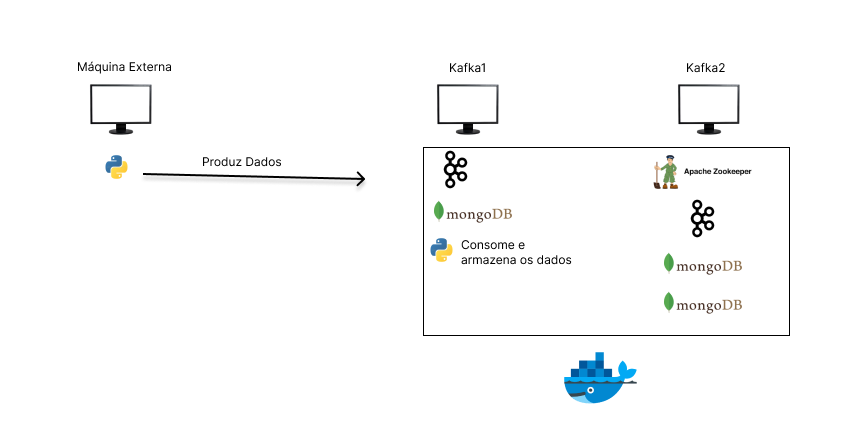

# Ingestão de Dados de uma API no MongoDB com Kafka e Docker

## Introdução

Ingestão de dados obtidos pela API api.spaceflightnewsapi no MongoDB. Os dados são capturados por um código Python que se conecta a um producer de um cluster Kafka. Então, um outro código Python que se conecta a um consumer de um cluster Kafka, consome os dados vindos do broker Kafka e os armazena em um cluster MongoDB.

Toda a infraestrutura é criada através de containers Docker.

**Tecnologias Usadas**: Python, Kafka, Zookeeper, MongoDB, Docker

## Preparação e Execução do Projeto

### Dados

Os dados vem da API api.spaceflightnewsapi que pode ser verificada pelo seguinte link: https://api.spaceflightnewsapi.net/documentation#/

### Detalhes do Projeto

Os dados estão basicamente em formato JSON e se referem a artigos fornecidos pela API. Um código Python acessa essa API e obtém os dados. Então, os dados obtidos são enviados para o producer de um cluster Kafka. Isso tudo é feito em uma máquina externa ao cluster Kafka e MongoDB.

O cluster Kafka é formado de 2 máquinas e possui 2 brokers. Os tópicos acessados pelo código Python são criados de forma a usarem todos os brokers.

O cluster MongoDB é formado por 2 máquinas e possui 3 instâncias.

Um código python que fica em uma das máquinas do cluster Kafka e MongoDB, obtém os os dados do consumer do cluster Kafka. Então, os dados são armazenados no cluster MongoDB.

### 1- Infraestrutura e Execução do Projeto no Docker

#### Infraestrutura

A infraestrutura do projeto se baseia em vários containers se comunicando entre si. Foram usadas duas máquinas, porém, seria possível usar mais.

Ainda foi usada uma terceira máquina que contém o código python que obtém os dados da API e os envia para o producer do Kafka.

Um resumo da infraestrutura pode ser verificado abaixo:

A máquina "kafka2" possui 2 instâncias do MongoDB, 1 instância do Kafka e 1 instância do Zookeeper que gerencia o cluster Kafka.

Já a máquina "kafka1" possui 1 instância do MongoDB, 1 instância do Kafka e 1 instância do código python que realiza o consumo das mensagens.

#### Execução do projeto

Para executar o projeto, é necessário seguir os seguintes passos:

Execute o código que irá gerar os certificados usados pelo Kafka.

<code>bash ./Docker/config/kafka/ssl-generate.sh</code>

Esse script será usado uma única vez e todas as máquinas deverão possuir os mesmos arquivos gerados. Use a mesma senha todas as vezes que for solicitado. Nesse caso de exemplo, a senha usada é "123456".

Preencha nos arquivos .env das pastas ./Docker/kafka1 e ./Docker/kafka2, os IP's das duas máquinas.

Com isso feito, na máquina "kafka2" execute:

<code>cd ./Docker/kafka2</code>

<code>docker-compose up -d</code>

Após isso, se todos os containers estiverem funcionando. Na máquina kafka1, preencha no arquivo .env da pasta ./python/consumer/config, as variáveis requeridas que são nada mais que configurações de conexão com o Kafka e o MongoDB.

Após isso, execute na máquina "kafka1":

<code>cd ./Docker/kafka1</code>

<code>bash start-container.sh --topico1 <NOME_TOPICO> --topico2 <NOME_TOPICO> --mongo1 <IP:PORTA> --mongo2 <IP:PORTA> --mongo3 <IP:PORTA></code>

Nesse último comando, para os parâmetros mongo, passe o IP e porta de cada instancia do MongoDB. Para os parâmetros topico, use o nome desejado para os tópicos que serão usados pelo Kafka e acessados pelo Python.

Se isso tudo funcionar, tanto o cluster Kafka e MongoDB estarão em funcionamento. Além disso, o código python para consumo de dados estará aguardando as mensagens chegarem.

Então, na máquina externa, preencha no arquivo .env da pasta ./python/producer/config, as variáveis requeridas que novamente, são nada mais que configurações de conexão com o Kafka e o MongoDB.

Com isso, será possível executar o comando:

<code>python ./python/producer/kafka_producer.py</code>

Se tudo ocorrer sem problemas, o projeto está pronto. Ou seja, foi criado um sistema que lê dados de uma API e os envia para o producer de um broker Kafka. Um consumer de um broker Kafka, captura esses dados e os armazena no cluster MongoDB. Essa captura de dados é feita em tempo real.

